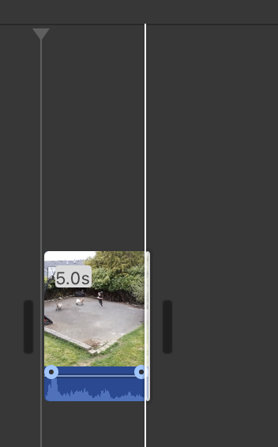
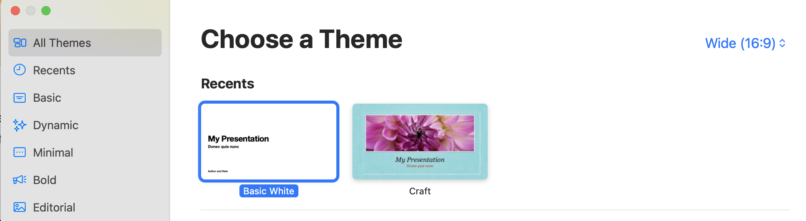

# Animated Gifs with IMovie and Keynote
Animated Gifs are short videos that loop continuously.

## Introduction to Animated Gifs with IMovie and Keynote
1. If you haven't already, download the [goat video](http://bit.ly/dsc-goat-video){:target="_blank"} or make a screen recording using press (Shift + Command + 5) for MAC and (key+Alt+R) for Windows. Note there are also many other screen recording tools such as Camtasia, ScreenCastify etc
2. We will open up **IMovie** and drag the downloaded file of the goat video or screen recording.
3. Next we will shorten our video to **5 seconds** by dragging the side of the video. Note typically Gifs are short. 
 
4. You can also remove the audio by right clicking the video clip and **detaching the audio**
5. Next, select the audio file and press **delete** or backspace
6. Select share by finding the square with the arrow pointing up.
7. Export file and name it goats
9. Now we will open Keynote and select a theme
10. Select **basic white** and make sure at the top right it says **wide (16:9)** (see photo) 
 
11. We will add media by selecting the **media** button and click **choose** (not photos and videos so that you can go and find your exported file of the goats from IMovie).
12. Once you find the goats.mp4 video click **insert**
13. In the top menu bar, click file and then **export to animated gif** 

Additonal Resources.
[Making an animated Gif with a Green Screen Background](https://blogs.glowscotland.org.uk/fa/digilearnfalk/2023/05/19/make-your-own-animated-gif/){:target="_blank"}

