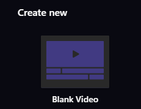
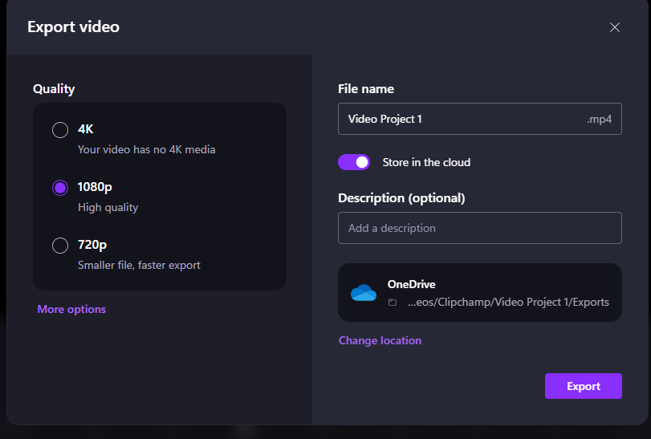

# Adding Audio and Free Music
In this exercise, you will add, remove, and have persistent audio in Clipchamp. If you have any questions or get stuck as you work through this, please ask your instructor for assistance.  Have fun!

1.  If you don’t have a video that you want to edit, let’s start by downloading the following video, and saving it to your desktop: [http://bit.ly/dsc-goat-video](http://bit.ly/dsc-goat-video){:target="_blank"} It may take 1 or 2 minutes to download.
2.  If the video starts playing you will have to right mouse click on the video & select “**Save Video As...**” and save it to the **Desktop** folder on your computer.

    

3.  Open ClipChamp if you have not already done so.
    -   Click on the **Create a New Video** icon.
    -   Beside the import media button, give your video project a name (“**test 2 video**” would be just fine).
    -   Click “**OK**”
      
4.  The audio in the clip can be modified by **selecting** the **clip** and then **clicking** on the **Audio icon** (located on the right hand side bar) and then moving the **slider** to the **percentage level** you want 
      
5.  Removing audio is useful if the audio is overpowered by background noise, or if you’re hoping to add your own audio or music overtop of your video or images. You do this by simply **clicking** on the **Audio icon** and then moving the **slider** to **0-percent**.
      <button onclick="toggle('gif1')">Show / Hide Animation </button>

      
      

6.  By removing audio from certain clips, it is very simple to have your own commentary track over a video, or include some music. You can add a soundtrack overlayed to create interesting audio effects, as well as remove broken or undesired audio to better suit your needs. 

7.  Add a music track from Clipchamp to your video by clicking **Music and SFX** (located in the left side bar). DRag and drop the desired music
      <button onclick="toggle('gif2')">Show / Hide Animation </button>

      
      

8.  OPTIONAL: Find a music clip from one of the websites below that fits your tone and sound effects that enhance your sense of location, and **save** the **mp3** music or sound effect to your hard drive (so that you can import it into your video project). There are many Creative Commons or royalty-free music websites that aggregate and distribute music that is shared with no or low copyright limitations including:
    -   Free Sound - A collaborative database of CC-licensed sound. Freesound focusses on sound and sound effects, not music - [http://bit.ly/33deeCq ](http://bit.ly/33deeCq ){:target="_blank"}
    -   Archive.org - Non-profit digital library with collections of digitized free movies, music, images, websites and more - [http://bit.ly/2DeGY2M  ](http://bit.ly/2DeGY2M  ){:target="_blank"}
    -   Free Music Archive - CC-licensed music grouped by genre - [http://bit.ly/2OgSUsS ](http://bit.ly/2OgSUsS ){:target="_blank"}
    -   ccMixter - CC-licensed music for film, video and games - [http://bit.ly/34hdOMq ](http://bit.ly/34hdOMq ){:target="_blank"}
    -   CCTrax - CC-licensed music grouped by genre - [http://bit.ly/2DbPjV8](http://bit.ly/2DbPjV8){:target="_blank"}

9.  Once you’re happy with your edited video you’ll need to export it in order to upload it to YouTube, or share it via Google Photos or some other sharing service:
 
10.  Congratulations, you’ve created a persistent audio project in OpenShot Video Editor! If you want to post your video to YouTube, just upload the file to your YouTube account.

[Bonus Activity: Screen Recording](screen-recording.html){: .btn .btn-blue } 
[NEXT STEP: Earn a Workshop Badge](informal-credentials.html){: .btn .btn-blue }
