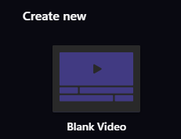
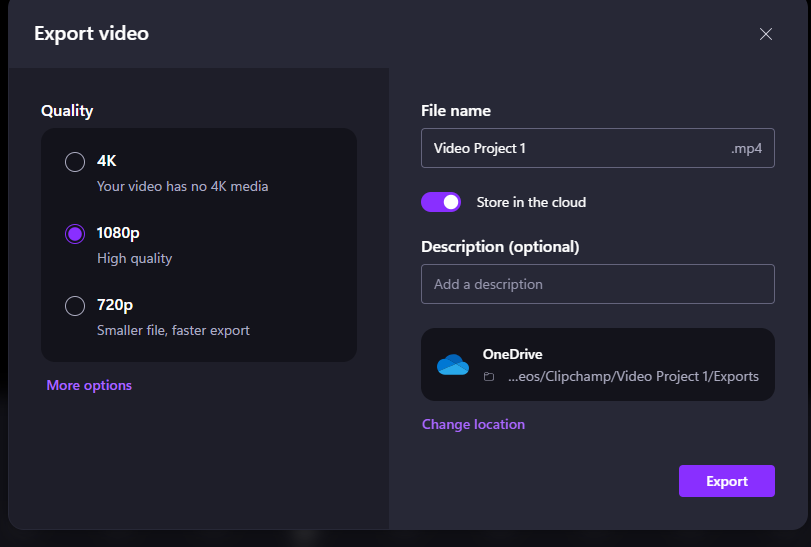

# The Basics
In this exercise, you will create and edit a movie using Microsoft ClipChamp. If you have any questions or get stuck as you work through this, please ask your instructor for assistance.  Have fun!

Pre-class Activity Preparation:

-   Make sure the Microsoft ClipChamp is installed on your computer by pressing the **Windows logo** button on your keyboard and then typing “**clipchamp**” (see the image on the right).
-   Open Microsoft ClipChamp by clicking on the “**ClipChamp**” icon.

1.  If you don’t have a video that you want to edit, let’s start by downloading the following video, and saving it to your desktop: [images/rocket.mp4](images/rocket.mp4){:target="_blank"} It may take 1 or 2 minutes to download.

2.  If the video starts playing you will have to right mouse click on the video & select “**Save Video As...**” and save it to the **Desktop** folder on your computer.

3.  Open Microsoft ClipChamp if you have not already done so.
    -   Sign in with your Microsoft credentials (if you have a Microsoft account) -OR- with a Google account -OR- You can use your email address to login.
    -   When asked, "What sort of videos bring you to Clipchamp?" select, **Education** for now (you can change this later if you'd like).
    -   When asked what level of education you are at, select **College or University**.
    -   Under Create new, click on the **Blank Video** button.
    

4.  Add the goat video to your video project by:
    -   Click on the purple **Import Media** on the top left of the navigation pane and then select “**goats.mp4**” from where ever you saved it (probably in your Desktop or Downloads folder).
    -   Finally, click on the file and select  “**Open**” on the bottom right of the dialog box.

5.  Drag your mp4 from the Project Library pane down to the Storyboard pane. Putting the video clip on the timeline enables you to click the **Play** icon or scrub through your video in the top right pane by grabbing the white "cursor" and dragging it back and forth, similar to how one would navigate Youtube videos.

    <button onclick="toggle('gif1')">Show / Hide Animation </button>
    

    
    

6.  First, play the 90-second video by pressing the play button below the video. (Note: pressing the spacebar will start and stop the video which is very handy while editing).
7.  Trim 20 or 30 seconds off the end of the video by selecting the light green **handle** on the far right of the video in the storyboard pane and then dragging it a bit to the left. Make sure the leftmost handle is positioned at the start of the video, and position the rightmost slider at roughly the 1-minute mark. 

    <button onclick="toggle('gif2')">Show / Hide Animation </button>

      
      

8.  Next, let’s split the video at approximately the 15-second mark from the beginning. To do this, select the video in the storyboard pane roughly the 15-second location and click and then select the “**Split**” button. Now you have two clips! 
    

9.  The trimmed and split video should now look like the photo below.
    

10.  **Optional** - Add a card between the two clips:
     -   Select the clip that we want to have a title card before (in this case, the second clip), and drag it approximately 10 seconds to the right.
     -   To add a black background, click **graphics** and select black. If you want a different color you can select **other color** 
     -   To add text, click “**add text**”. Select the text style on the left hand side by dragging and dropping the desired text style onto the free black background, click into the text box, and change the text to something more appropriate like “Raisins”. Feel free to also choose a fun font from the menu on the left. 

Extra: If you wish to add a background image, select “**Stock images**” icon on the left navigation bar, and then search and select the **drape" background, and drop it in the gap between the two video clips. 
    
<button onclick="toggle('gif3')">Show / Hide Animation </button>

      
      

11.  Let’s add a title to the video: 
     -   Select the first clip from the storyboard pane and then click the “**Add Text**” option.
     -   In the left side, drag and drop desired style, replace “Title” with your chosen title, such as “Feeding Time”, by modifying the text in the right side pannel. 
     -   To change the location of the text, click on the texbox on the screen and move it to the desired location on your video. 
     -   Select a fun font for your title from the menu on the right.
     -   The handles on the bottom show where the title will be displayed in your clip. Make sure that the leftmost handle is at the start of the clip and move the rightmost handle to roughly the 5 second location.     

     <button onclick="toggle('gif4')">Show / Hide Animation </button>
     

     
     

12. Now let’s add credits for your video.
     -   After the final clip from your storyboard pane, add another black background by going to **graphics** and selecting **black** and then add text to the card by selecting **text**.
     

13.  Next, let’s reduce the volume of the audio during the credits
     -   Select a video clip from your credits in the storyboard pane by clicking on it. The audio settings will appear on the right hand side pannel.
     -   Drag the slider to adjust that clip’s volume. Do this for all your credits clips.
      

14. Once you’re happy with your edited video you’ll need to export it in order to upload it to YouTube, or share it via Google Photos or some other sharing service:
     -  Click “**Export**” 
 
     -  Select whichever quality you want from the drop-down menu (higher quality results in larger files).
     -  Next, select where the file will be saved and give it a memorable name. 

15. Congratulations, you’ve created and edited a video in Microsoft Clipchamp!

[NEXT STEP: Slow Motion and Cropping](cc-slo-mo-cropping.html){: .btn .btn-blue }
