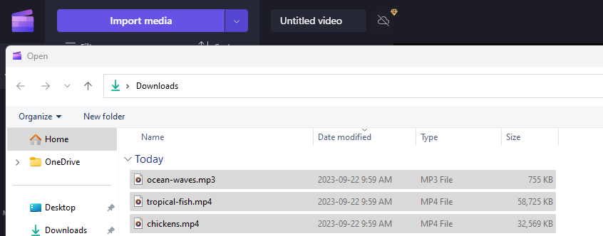
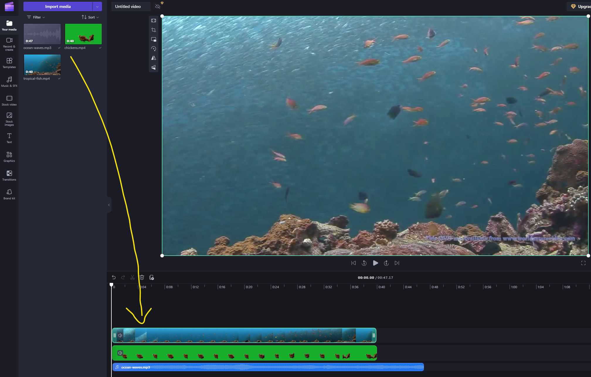
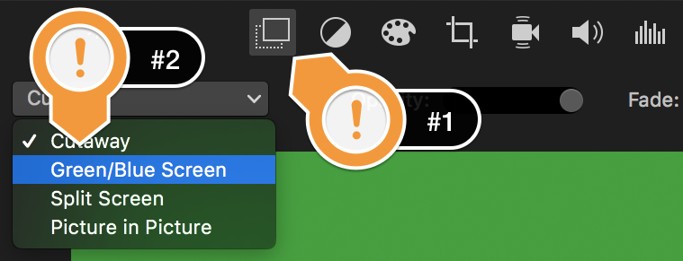

 

# Green Screen
In this exercise, you will create and edit a movie in Clipchamp, including using green screen video and importing audio to overlay your clip. If you have any questions or get stuck as you work through this, please ask your instructor for assistance.  Have fun!

1. If you don’t have a green screen video that you want to edit, let’s start by downloading the audio and video files below and save them to your desktop: 
- [Green screen chickens](https://bit.ly/34yuUHH){:target="_blank"}
- [Background tropical fish](https://bit.ly/2SvcQey){:target="_blank"}
- Audio - [ocean waves mp3](https://bit.ly/3upBsCA){:target="_blank"} 
**Note:** If the video starts playing in your browser you will have to right mouse click on the video and select “**Save Video As**…” & save to your Desktop.

2. Open Clipchamp.

3. Next click on the “**Import Media**”.  
- Click on the “**Desktop**” on the left navigation pane and then hold down the “Command” key and select the “**chickens.mp4**” file, “**tropical-fish.mp4**” file, and the “**ocean-waves.mp3**” file. 
- Finally, click on the blue “**open**” button on the bottom right of the dialogue box.

4. Add the video clips and audio clip to the timeline (see pic below for example):
- Drag the “**tropical-fish.mp4**” video clip you just imported into the timeline at the bottom of the iMovie screen.
- Next, drag the “**green screen chickens**” video on top of your background video.
- Lastly, drag the “**ocean waves**” audio below your background video clip.
  

5. Let’s make the green screen magic happen!  
- First, select the green screen clip in the timeline with the chicken.
- Next click on the “**video overlay**” button just above the video preview window in the top right of the program (see #1 to the right).
- Then click on the dropdown (see #2) and select, “**Green/Blue Screen**”
- Your chickens should be standing on the coral under the ocean now when you preview the video!

6. Trim and modify audio levels in video and audio clips: 
- Let’s trim the audio clip by selecting the audio clip and then grabbing the yellow handle on the right of the clip and dragging it even with the video clips.
- There is no audio in the green screen video clip, so we don’t have to worry about it.
- There is audio in the tropical fish video, so we will remove that audio by selecting the tropical fish video clip, and then mousing over the audio “line” and dragging it to the bottom of the blue area.
- If you want to make the background ocean waves audio louder or softer, simply select the green audio track, and then grab the horizontal line in the middle and move it up or down.

7.  Let’s add a title to the video by selecting the “**Titles**” tab at the top of the iMovie window, and the drag and drop one of the titles at the beginning of the timeline. 
- In the video preview window double click to edit the title text.

8. Now add credits for your video by dragging and dropping a credit style “**title**” from under the “**Titles**” tab to the end of the video. Edit this same way you edited the title in step #7.

9. Once you’re happy with your edited video you’ll need to export it in order to upload it to YouTube, or share it via Google Photos or some other sharing service:
- Press the upload button in the very top right of the iMovie window (#1 to the right).
- Next, select the “**File**” icon (#2 to the right).
- Give your movie a descriptive name, and then press the “**Next**” button. Select the folder where you want to put your video and press the “**Save**” button.
- It will take a few minutes for iMovie to export your video.

10. Congratulations, you’ve created and edited a more advanced video in iMovie! Your video should look something [like this](https://goo.gl/yBjs7k){:target="_blank"} 
<iframe width="560" height="315" src="https://www.youtube.com/embed/AmOVm-GxP1I" title="YouTube video player" frameborder="0" allow="accelerometer; autoplay; clipboard-write; encrypted-media; gyroscope; picture-in-picture" allowfullscreen></iframe>

[NEXT STEP: Screen Recording](screen-recording.html){: .btn .btn-blue } 
-OR- 
[NEXT STEP: Earn a Workshop Badge](informal-credentials.html){: .btn .btn-blue }
