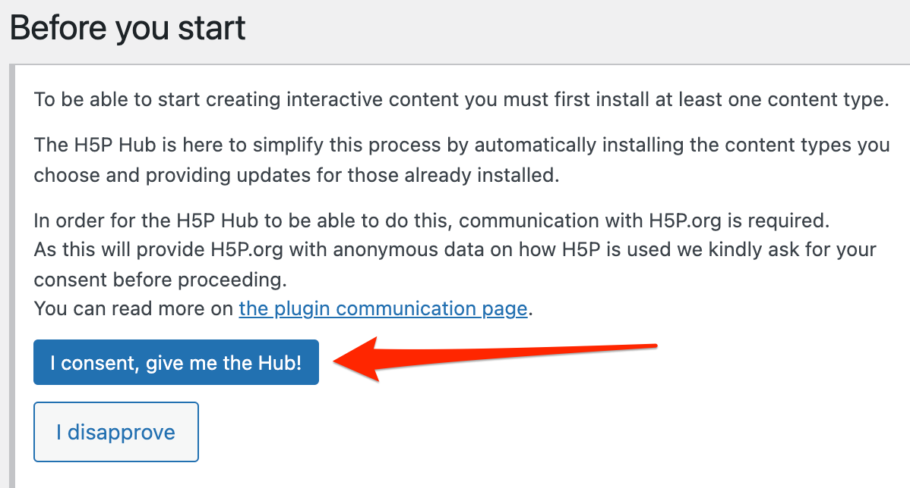

 
# Interactive Videos on a WordPress Blog with H5P
In this exercise, you will practice capturing still shots of all or parts of your screen, annotating the screen captures and inserting the resulting image file into a blog post. If you have any questions or get stuck as you work through this, please ask your instructor for assistance.

Before you start making your own interactive video, please watch this excellent example of an H5P video being used to **[teach a grade 2 science experiment virtually](https://brittanyseducblog.opened.ca/2020/10/03/science-demonstration-video){:target="_blank"}**. Have fun!  

1. If you haven’t done so already, install the H5P plugin in your WordPress blog, or if you have a UVic student, please create an [OpenEd.ca blog](https://opened.ca/get-started/){:target="_blank"} for this exercise if you don’t already have one.

2. Enable the H5P plugin on your WordPress blog:
- In your blog administration control panel click on the **Plugins** button, on the left navigation bar, and then scroll down and find the H5P plugin, and press the **Activate button**.

3. Navigate to the H5P plugin setting page & enable the Interactive video tool if necessary and add new H5P content:
- Mouse over the **H5P Content** button on the left navigation bar and then select the **Add New**.
- If this is your first time using H5P, click on the blue **I consent, give me the Hub!** button to enable the H5P features you will need to make your interactive video.

- If this is your first time using H5P on your blog, you’ll need to click on the **Get** button beside the top item (Interactive video).

4. Add a new video to and prepare to add interactive elements to it:
- Click on the **Interactive** button near the middle of the screen.
- Click on the **light grey plus** button under the “**Add a video**” text.
- Copy and paste a YouTube URL into the text box and click the **Insert** button. **-OR-**
- Click on the **Upload video file** button and upload your video to your blog.
- Click on the **text box** below the Title label, and type in the title for your video.

5. Add an information text box to a video:
- Click on Step 2 **Add interactions** tab.
- On the toolbar above the video click on the **T** button.
- In the dialogue box that appears, click on the **Pause video** checkbox.
- Next type the text you want to appear in the dialogue box in the **Text** field near the bottom.
- Click the **Poster** radio button just below the Pause video checkbox.
- Click the blue **Done** button near the top right corner.
- You can now move the text box around the video window and resize the text box to fit your needs.

6. Add a multiple-choice question to your video
- On the toolbar above the video click on the multiple-choice button (the button with 3 round circles and 3 lines beside them).
- In the dialogue box that appears, click on the Pause video checkbox.
- Click the Poster radio button just below the Pause video checkbox.
- Next type the title you want for your multiple-choice question in the Title text box.
- Next type in the question in the Question text Text field.
- Next type in the correct answer in the first Alternatives field.
- Type in other answers below, clicking the Add answer button as necessary.
- When you’ve finished adding alternative answers, click the blue Done button near the top right corner of the web page.
- You can now move the multiple-choice box around the video window and resize the text box to fit your needs.
- Finally, click the blue Create button in the very top right corner of the web page. Your interactive video is now ready to be embedded in a blog post or web page!

7. Add your interactive video to a blog post:
Click on the Posts button on the left navigation bar.
Click on the Add New button near the top left of the browser window.
Type in a Title and some text in the body of the blog post and then press enter on your keyboard once.
Click on the Add H5P button just above the body of the blog post.
A dialogue box will appear. Press the Insert button beside the H5P interactive element you just created.
Some code was just inserted into your blog post that will look something like this: [h5p id=”1”] do not delete this code or your interactive element will disappear from your post.
Click on the Publish or Update button on the right of your window, and then check your new interactive element on your blog post!

8. Congratulations, you’ve created an interactive video and incorporated it into your blog. Great job!

1. Install the Screencastify Plugin into Google Chrome or Microsoft Edge (if you would like to watch a video for how to install the plugin, watch [this video](http://bit.ly/2mtNP3E){:target="_blank"}
- Open the Google Chrome or Microsoft Edge web browser on your computer.   
-   Install the Screencastify Plugin in Google Chrome by navigating to [this page](https://chrome.google.com/webstore/detail/screencastify-screen-vide/mmeijimgabbpbgpdklnllpncmdofkcpn?hl=en){:target="_blank"} and clicking on the Add to Chrome (if you are using the Edge browser you will need to click on the blue button to enable external app stores).
- Click on the little salmon coloured Screencastify icon on the top right of your chrome browser.
-   On the web page that is displayed, click on the Sign in with Google button, and enter your Google credentials.
- Give Screencastify access to your computer’s camera and microphone along with drawing and annotation tools by pressing the **Next** button, and then pressing the **Allow** button on the dialogue button that appears.
- Good job! You are now ready to record your first screencast.

Great Job! 

[NEXT STEP: Bonus Activity: Storyboarding](storyboarding.html){: .btn .btn-blue }
