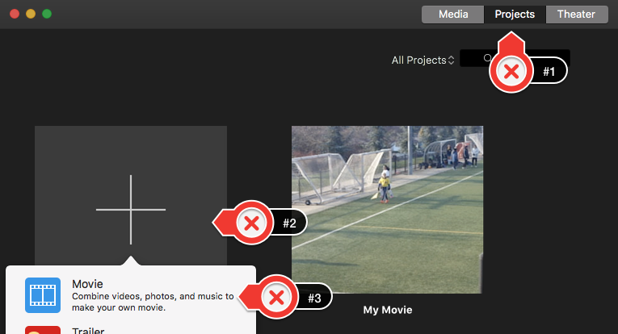
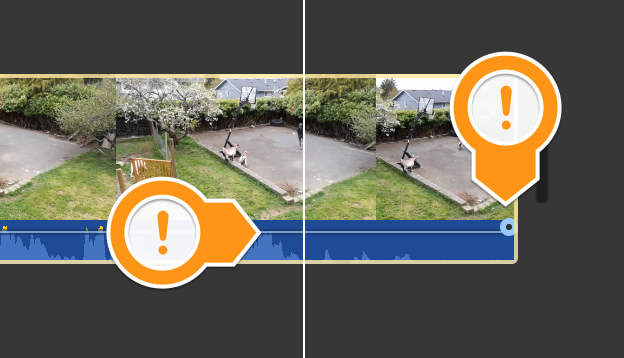
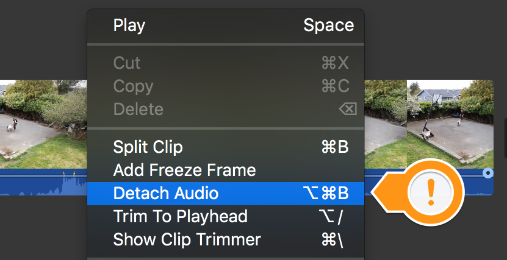
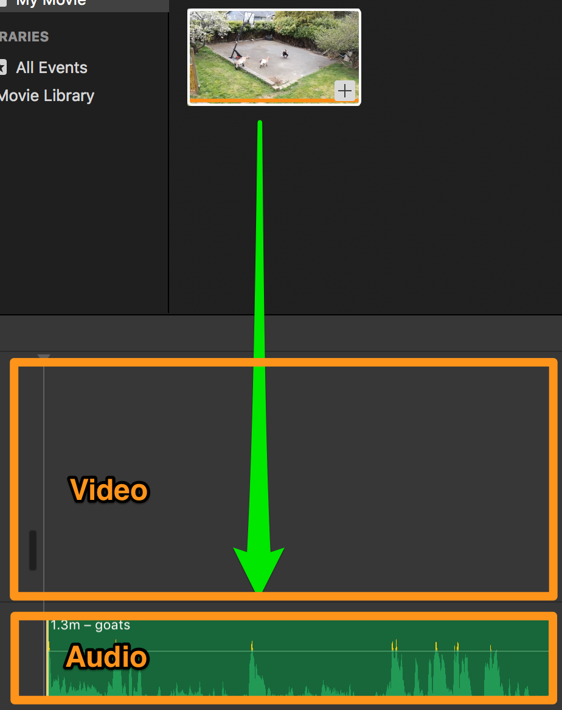
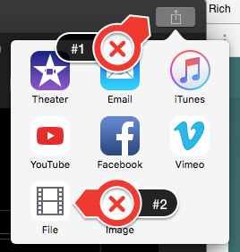

 
# Detaching Audio and Adding Music
In this exercise, you will add, remove, and have persistent audio in an iMovie project. If you have any questions or get stuck as you work through this, please ask your instructor for assistance.  Have fun!

1. If you don’t have a video that you want to edit, let’s start by downloading the following [Fainting Miniature Goat video](https://bit.ly/dsc-goat-video){:target="_blank"}, and saving it to your desktop. It may take 2 or 3 minutes to download. 
**Note:** If the video starts playing you will have to right mouse click on the video and select “**Save Video As**…” to save it to your computer’s desktop.

2. Open iMovie by clicking on the iMovie icon (see the purple icon on the right for what it should look like).
- Make sure that the “**Projects**” tab on the top of the program is selected (labelled #1)
- Then click on the large “**+**” sign with “**Create New**” underneath (labelled #2).
Now select “**Movie**” (labelled #3).

3. Next click on the “**Import Media**” button in the middle of the iMovie screen. 
- Click on the “**Desktop**” on the left navigation pane and then select “**goats.mp4**” 
- Finally, click on the blue “**Import Selected**” or “**Import All**” button on the bottom right of the dialog box.

4. Drag the video clip you just imported into the timeline at the bottom of the iMovie screen.

5.  The active clip will have two portions to it. The top two-thirds show the video, and the bottom third shows the audio as a blue bar. When the audio is separate from the video, it is a green bar. This bar has two parts to it, one is a horizontal grey line, and a grey circle on each end. 

6. The audio in the clip can be modified by dragging the grey line up or down to adjust general volume, or you can drag the grey circles on the audio to create a fade in and fade out effect. 

7.  You can also separate the audio from the file by clicking on the clip and selecting “**modify**” > “**Detach Audio**” Or right-clicking and selecting “**Detach Audio**”. This will separate the audio and place it below the video. This allows the audio to be modified, or even completely removed. 

8.  If only the audio from a clip is wanted, you can detach the audio and delete the video by moving the audio timeline down one level and pressing the delete button on your keyboard. This will disable the video and turn it into an audio-only clip.

9. Removing audio is useful if the audio is overpowered by background noise, or if you’re hoping to add your own audio or music overtop of your video or images. 

10. By removing audio from certain clips, or dragging audio into the audio track, it is very simple to have your own commentary track over a video. You can add a soundtrack and have multiple audio tracks overlayed to create interesting audio effects, as well as remove broken or undesired audio to better suit your needs. 

11.  Once you’re happy with your edited video you’ll need to export it in order to upload it to YouTube, or share it via Google Photos or some other sharing service:
- Press the **upload button** in the very top right of the iMovie window (#1 to the right).
- Next, select the “**File**” icon (#2 to the right).
- Click on “**My Movie**” & give your movie a descriptive name, and then press the “**Next**” button. Select the folder where you want to put your video and press the “**Save**” button.
- It will take a few minutes for iMovie to export your video.

12. Congratulations, you’ve created a persistent audio project in iMovie! If you want to post your video to YouTube, just upload the file to your YouTube account.

13. **Bonus Content**: Find music that fits your tone and sound effects that enhance your sense of location. There are many Creative Commons or royalty-free music websites that aggregate and distribute music that is shared with no or low copyright limitations including:
- [Free Sound](http://bit.ly/33deeCq){:target="_blank"} - A collaborative database of CC-licensed sound. Freesound focusses on sound and sound effects, not music
- [Archive.org](http://bit.ly/2DeGY2M){:target="_blank"}- Non-profit digital library with collections of digitized free movies, music, images, websites and more  
- [Free Music Archive](http://bit.ly/2OgSUsS){:target="_blank"} - CC-licensed music grouped by genre 
- [ccMixter](http://bit.ly/34hdOMq){:target="_blank"} - CC-licensed music for film, video and games 
- [CCTrax](http://bit.ly/2DbPjV8){:target="_blank"} - CC-licensed music grouped by genre

[NEXT STEP: iMovie Cropping and Slo-mo](imovie-cropping-slo-mo.html){: .btn .btn-blue }

[NEXT STEP: iMovie Green Screen](imovie-green-screen.html){: .btn .btn-blue }
