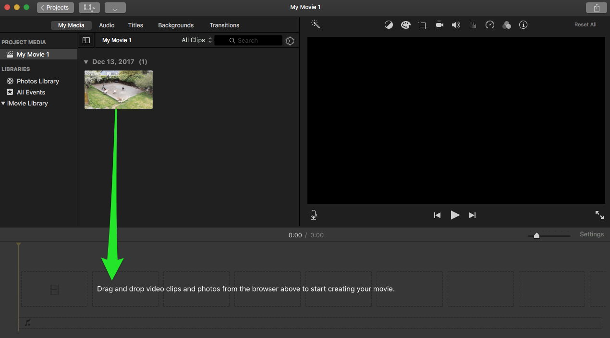
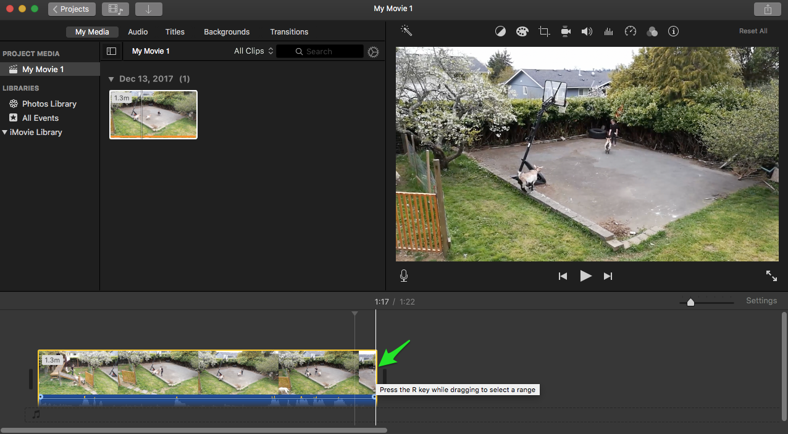
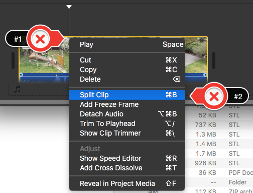
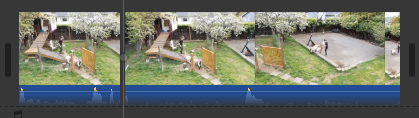
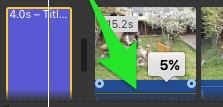

 
# Basics
In this exercise, you will create and edit a movie using iMovie. If you have any questions or get stuck as you work through this, please ask your instructor for assistance.  Have fun!

1. If you don’t have a video that you want to edit, let’s start by downloading [this video](http://bit.ly/dsc-goat-video){:target="_blank"}, and saving it to your desktop. It may take 1 or 2 minutes to download. **Note**: If the video starts playing you will have to right mouse click on the video and select “**Save Video As**…” to save it to your computer’s desktop.
 
2. Open iMovie by clicking on the **iMovie icon** (see the purple icon on the right for what it should look like).
- Make sure that the “**Projects**” tab on the top of the program is selected (labelled #1)
- Then click on the large “+” sign with “**Create New**” underneath (labelled #2).
- Now select “**Movie**” (labelled #3).

3. Next click on the “**Import Media**” button in the middle of the iMovie screen.  
- Click on the “**Desktop**” on the left navigation pane and then select “**goats.mp4**” 
- Finally, click on the blue “**Import Selected**” or “**Import All**” button on the bottom right of the dialog box.

4.  Drag the video clip you just imported into the timeline at the bottom of the iMovie screen. 

5. First, play the 90-second video by pressing the play button below the video. (Note: pressing the spacebar will start and stop the video which is very handy while editing)
 
6. Trim 20 or 30 seconds off the end of the video by selecting the video in the timeline and then moving the mouse pointer over the end of the video clip and then drag the handle to the left. The same can be done with the beginning of the video if you’d like.

7.  Next, let’s split the video at approximately the 15-second mark from the beginning. To do this, select the video in the timeline, then right mouse click at about the 15-second mark, and finally select “**Split Clip**”

8. The trimmed and split video should now look like the photo below and to the right.

9. Now let’s drag and drop a transition between the split videos.
- This is done by selecting the “**Transitions**” tab on the top of the iMovie window. 
- Next, select the “**Mosaic**” transition, and drag it and drop it between the two video clips in the timeline.

10. Let’s add a title to the video by selecting the “**Titles**” tab at the top of the iMovie window, and then drag and drop one of the titles at the left of the timeline, or on top of the video in the timeline. 
- In the video preview window double click to edit the title text.

11. Now add credits for your video by dragging and dropping a credit style “**title**” from under the “**Titles**” tab to the end of the video. Edit this same way you edited the title in step #10.

12.   Next, let’s mute or reduce the volume of the audio:
- Grab the horizontal line in the blue audio track underneath one of the video clips and drag it downwards. 
- iMovie will display the percentage of audio volume. Make the volume as high or low as suits your tastes.

 
13. Once you’re happy with your edited video you’ll need to export it in order to upload it to YouTube, or share it via Google Photos or some other sharing service:
- Press the **upload button** in the very top right of the iMovie window (#1 to the right).
- Next, select the “File” icon (#2 to the right).
- Click on “**My Movie**” & give your movie a descriptive name, and then press the “**Next**” button. Select the folder where you want to put your video and press the “Save” button.
- It will take a few minutes for iMovie to export your video.

14. Congratulations, you’ve created and edited a video in iMovie! If you want to post your video to YouTube, just upload the file to your YouTube account.

[NEXT STEP: iMovie Cropping and Slo-mo](imovie-cropping-slo-mo.html){: .btn .btn-blue }
