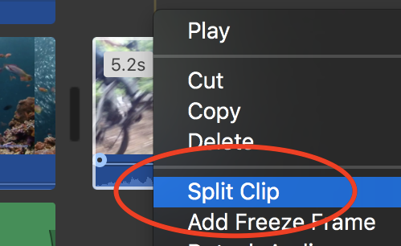
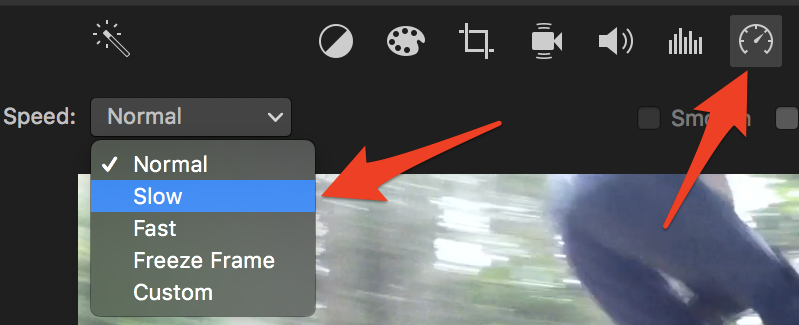
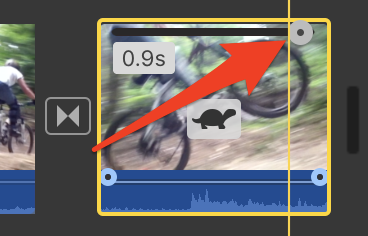
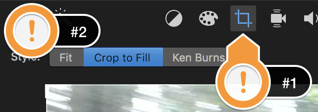
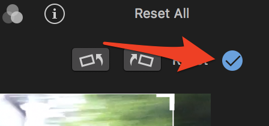
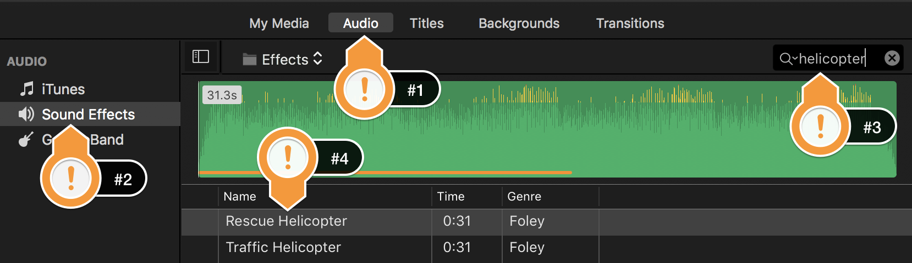
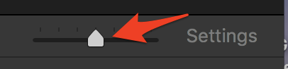
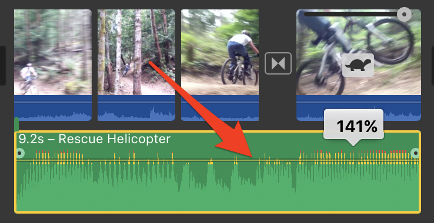

 
# Cropping and Slo-mo
In this exercise, you will create and edit a movie in iMovie, including using splitting and duplicating a video clip, making a slow-motion video clip, cropping a video clip, and importing audio to overlay your clip. If you have any questions or get stuck as you work through this, please ask your instructor for assistance.  Have fun!

1. Let’s start by downloading the [Mountain biking video](https://bit.ly/3vrLJj0){:target="_blank"} and save it to your desktop. 
**Note**: If the video starts playing in your browser you will have to right mouse click on the video and select “**Save Video As**…” & save to your Desktop.

2.  Open iMovie by clicking the purple star-shaped icon. 
- Make sure that the “**Projects**” tab on the top of the program is selected (labelled #1)
- Then click on the large “**+**” sign with “**Create New**” underneath (#2).
- Now select “**Movie**” (#3).

<button onclick="toggle('gif1')">Show / Hide Animation </button>

      
      

3. Next click on the “**Import Media**” button in the middle of the iMovie screen.  
- Click on the “**Desktop**” on the left navigation pane and then select the “**bike.mp4**” file. 
- Finally, click on the blue “**Import Selected**” button on the bottom right of the dialogue box.

<button onclick="toggle('gif2')">Show / Hide Animation </button>

      
      

4. Make a slow-motion video clip with the “**bike**” video:
- Drag the “**bike**” video clip into the timeline below.
- Now let’s isolate a short clip to slow down. Select the bike video clip, and then scrub through it (by moving your mouse over it), and click on the clip before the bike goes over the jump. 
- Right mouse click on the vertical line on the clip (or a 2 fingered click on a mac) then select “**Split Clip**” from the menu.
- Next, scrub through to the point of the video where the bike lands, and click on the clip at that point.
- Right mouse click on the vertical line and right mouse click (or a 2 fingered click on a mac) then select “**Split Clip**” from the menu.

<button onclick="toggle('gif3')">Show / Hide Animation </button>

      
      

- Let’s make a copy of the isolated clip by selecting the isolated clip and then on the top menu, select “**Edit**” -> “**Copy**”.
- Move the mouse to the very end of the bike video and click there, then select “**Edit**” -> “**Paste**”. You should now have 4 video clips in the timeline.

<button onclick="toggle('gif4')">Show / Hide Animation </button>

      
      

-  To slow down this clip, select the clip and then press the “**Speed**” button above the video preview, then select “**Slow**” in the speed drop down menu (see image to the right). 
- Now let's adjust the speed of the clip by selecting the grey round circle handle in the top right of the slow-motion video clip, and drag it to the right until the clip is 3 or 4 seconds long. 
- Add a transition between your regular and slow-motion clip, by selecting the “**Transition**” tab in the top menu, and dragging a “**Cross Dissolve**” between the last two video clips.

<button onclick="toggle('gif5')">Show / Hide Animation </button>

      
      

5. Crop or zoom in on a video clip: 
- Select the slow-motion video clip in the timeline, and then press the “**Crop**” button (#1) above the video preview, and then select the “**Crop to Fill**” button (#2).
- Now grab one of the white handles in a corner of the video preview, and drag it until you’ve cropped the video the way you like it.

- Finalize this by clicking on the little blue circle with a check mark in the middle. Good job, you’ve cropped your video!

<button onclick="toggle('gif6')">Show / Hide Animation </button>

      
      

6. Add a Sound Effect to your video:
- Start by clicking on the the “**Audio**” tab (#1), then click on “**Sound Effects**” (#2), then type “**helicopter**” into the search box (#3), and finally, select “**Rescue Helicopter**” (#4) and drag and drop it below the bike video on the timeline, and to the far left.

- This audio clip is quite a bit longer than your video clip. To fix this: 
        - Select the audio clip, scroll to the far right to find the end of the audio clip.
        -  Grab the handle at the end of the audio clip and drag it to the left until your video and audio clips are the same length (pro tip: scale your timeline by moving the slider in the middle right of your screen. 
- If you want to make the helicopter audio louder or softer, simply select the green audio track, and then grab the horizontal line in the middle and move it up or down. 50% volume seems pretty good.

<button onclick="toggle('gif7')">Show / Hide Animation </button>

      
      

7. Congratulations, you're done! Feel free to add a title & credits to your video if you want. Your video should look something [like this](https://goo.gl/gkqx8b){:target="_blank"} 
<iframe width="560" height="315" src="https://www.youtube.com/embed/YE3F7FDTaRY" title="YouTube video player" frameborder="0" allow="accelerometer; autoplay; clipboard-write; encrypted-media; gyroscope; picture-in-picture" allowfullscreen></iframe>

[NEXT STEP: iMovie Green Screen](imovie-green-screen.html){: .btn .btn-blue }
