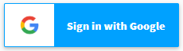
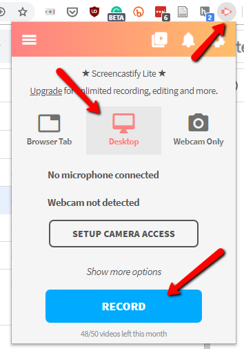
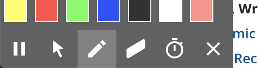
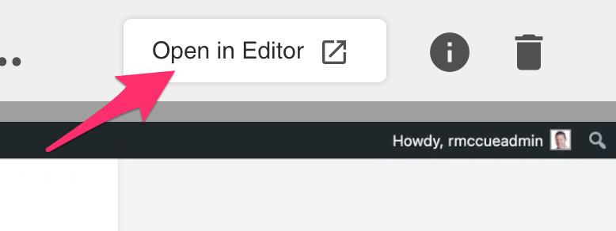
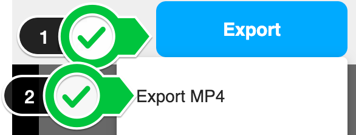
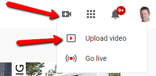
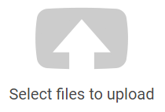

 
# Screen Recording
Let’s create a short little screencast with Screencastify. You will need a Google account and the Google Chrome or Microsoft Edge web browser in order to complete this activity.  If you have any questions or get stuck as you work through this in-class exercise, please ask the instructor for assistance.  Have fun!  

1. Install the Screencastify Plugin into Google Chrome or Microsoft Edge (if you would like to watch a video for how to install the plugin, watch [this video](http://bit.ly/2mtNP3E){:target="_blank"}
- Open the Google Chrome or Microsoft Edge web browser on your computer.   
-   Install the Screencastify Plugin in Google Chrome by navigating to [this page](https://chrome.google.com/webstore/detail/screencastify-screen-vide/mmeijimgabbpbgpdklnllpncmdofkcpn?hl=en){:target="_blank"} and clicking on the Add to Chrome (if you are using the Edge browser you will need to click on the blue button to enable external app stores).
- Click on the little salmon coloured Screencastify icon on the top right of your chrome browser.
-   On the web page that is displayed, click on the Sign in with Google button, and enter your Google credentials.
- Give Screencastify access to your computer’s camera and microphone along with drawing and annotation tools by pressing the **Next** button, and then pressing the **Allow** button on the dialogue button that appears.
- Good job! You are now ready to record your first screencast.

2. Record a screencast:  
- First, open the program(s) or web browser with the software you want to demonstrate how to use.
- Click on the little salmon coloured Screencastify icon on the top right of your chrome browser. 
- Click on **Desktop**, and then **Record**. Note: these are ideal if you are demonstrating how to use the software on your computer like Microsoft Word. If you are demonstrating how to use a website, then you would select **Browser Tab**. 
- A dialogue box will appear asking you if you would like to capture the entire screen or an application window. Select **Your Entire Screen**. If you have more than one monitor attached to your computer you will be asked to select which display you want to capture. Click the blue **Share** button.
- Screencastify will count down from three seconds before it starts recording.
-   To highlight things in a browser window you can use the built-in annotation tool to draw. Select the pencil tool and your favourite colour and start marking up. You can erase things with the **eraser** tool as well of course (to the right of the pencil). 
- Note: Annotation tools are not available in other programs like MS Word.
- Do your demonstration, talking through what you are doing, and then press the Stop Sharing button at the bottom of the screen when you are done.

3. Download your video to a file on your hard drive:  
- Click the **Open in Editor** button on the right side of the browser window. A new browser tab should open in 5-10 seconds.
- Click on the blue **Export** button on the top right of the browser window.
- In the dialogue box that pops up, give the file an appropriate name (take care not to delete the .mp4 file extension), **navigate to your Desktop folder**, and then press the **Save** button. It can take a few minutes for Screencastify to create the MP4 file for you to download to your computer.

4. At this point, if you can either edit your video - see the video editing workshop materials if you’d like to learn how to edit your screencast video. Or if you are happy with your video as it is, you can upload your MP4 video file to YouTube or to your OpenEd.ca WordPress website (the same way you would upload an image to your OpenEd Website). Here are instructions on how to upload your video to YouTube:
- In another browser tab, open up [YouTube.com](https://www.youtube.com/){:target="_blank"}
-   Click on the upload button on the top right of the YouTube window (see screenshot to the right), and then click on Upload video
- Next click on the Select files to upload button in the middle of the screen. 
-  Browse to your MP4 video file which should be on your Desktop, and select it, and then press the **Open** button.
- While your file is uploading you should give your video and appropriate name and description. 
- If you want to change the license for your video to a Creative Commons license, press the **Advanced settings** tab, and under License and rights ownership, select the **Creative Commons - Attribution** license.
- Once you’re happy with the name and description of the file, press the blue **Done** button on the top right of the window.
- Your video is now published and a URL that you can use to distribute your video is near the top of the web page. 

Great Job! 

[NEXT STEP: Interactive Videos with H5P](h5p.html){: .btn .btn-blue } 
-OR- 
[NEXT STEP: Earn a Workshop Badge](informal-credentials.html){: .btn .btn-blue }
