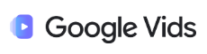
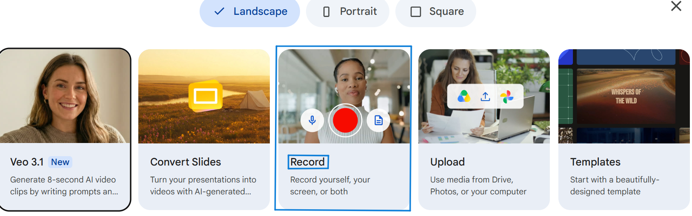
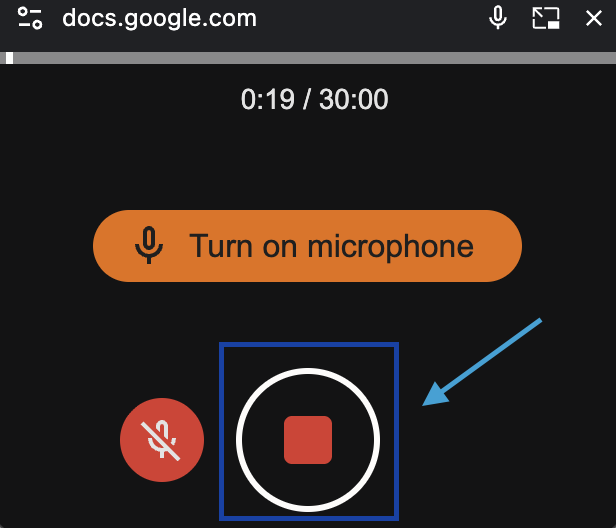
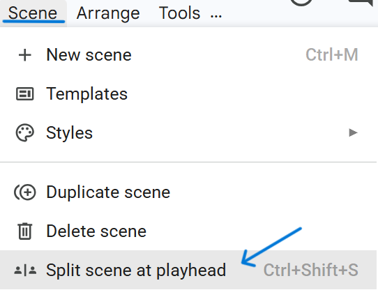
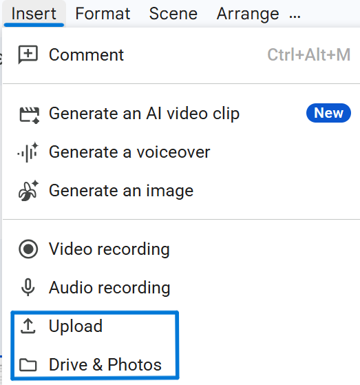
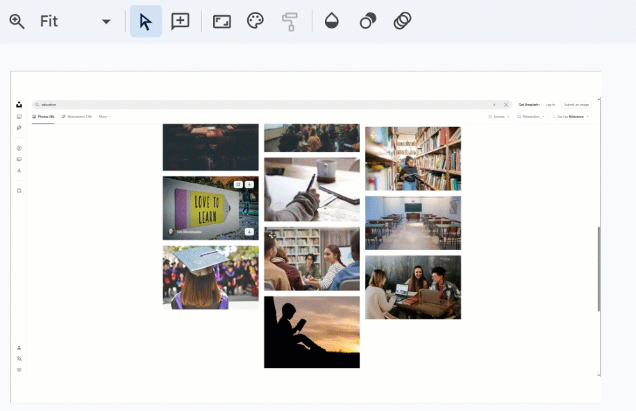
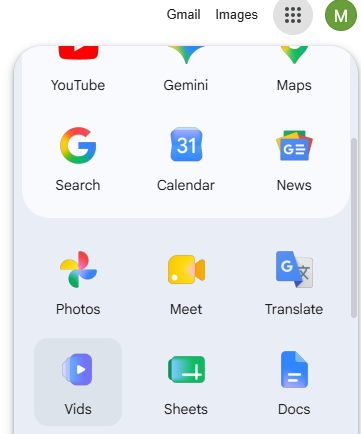
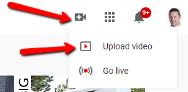
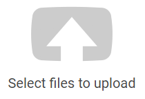

 
# Screen Recording 
Let’s create a short little screen recording with Google Vids. You will need a Google account and the Google Chrome or Microsoft Edge web browser in order to complete this activity.  If you have any questions or get stuck as you work through this in-class exercise, please ask the instructor for assistance.  Have fun!  

1. Using [Google Vids](https://vids.new){:target="_blank"} 
- Open Google Chrome or Microsoft Edge
- Navigate to Google Vids by clicking [this link](https://vids.new){:target="_blank"} 
- You will be prompted to sign in to your Google account if you're not already signed in 
- Once Google Vids has loaded, a pop-up window with several options will appear

- Click the option labelled **Record** 
- If prompted, allow Google Vids to access your microphone and screen 
- Good job! You are now ready to record your first screen recording 

2. Record your screen: 
- Before you begin recording, open the program, website, or document you would like to demonstrate
- Go back to Google Vids and at the top of the screen, click **Screen** to start the screen recording process
- You will be prompted to choose what to share, such as a single browser tab, a window, or your entire screen
- Select the tab or window you chose to demonstrate and click the blue **Share** button
- Google Vids will count down from three seconds before it starts recording   
- If you need to pause your recording, click the red pause button in the small recording window. When you are ready to continue, click the same button again to resume your recording 
- When you are finished with your demonstration, click the pause button again to stop recording, then switch back to your Google Vids tab
- You can preview your video to make sure everything was captured correctly, or click **Insert** to add the recording to your project timeline and begin editing

    <button onclick="toggle('gif1')">Show/Hide Animation</button>
    

    
    
 

3. Edit your recording:
    
    **Trim your video**
   - Click on the video clip in the timeline
   - Drag either end of the clip inward to remove unwanted footage from the begining or end of your video
   
   **Split a video clip**
   - Move the playhead, or click on the point in the timeline where you want to split your video
   - In the menu bar at the top, click **Scene**, then select **Split scene at playhead**
   - 
   - Alternatively, you can use the keyboard shortcut **Ctrl + Shift + S** (Windows) or **Command + Shift + S** (Mac)
   - Your video will now be split into two separate clips that can be edited independently

    **Add transitions**
   - After splitting your clip, click the button located in between the two clips (**Add transition** button)
   - A pop-up with various transition types will appear
   - Select the transition you would like to use and choose the duration
     
    <button onclick="toggle('gif2')">Show/Hide Animation</button>
    

    
    

    **Add background audio**
   - Click **Insert** in the menu bar at the top and select **Upload** 
   - Browse your computer and select the MP3 file you would like to add (You can also upload files from your drive by clicking **Drive & Photos**)   
   - Once uploaded, your audio will be added to the timeline, where you can adjust its placement and length

    **Add text and graphics**
   - Click **Insert** in the menu bar and select **Text**
   - A pop-up with various text options will appear
   - Select a text style that you like, then customize the font, size, colour, and formatting (such as bold or italic) to suit your video
   - You can also add captions, shapes, images, icons, stickers, and other visual elements from the **Insert** menu
   - Drag and resize the elements to position them where you would like them to appear

    **Crop your video**
   - Click on the video clip in the timeline, then click directly on the video preview
   - In the toolbar at the top of the screen, click the **Crop** icon
   - Drag the edges or corners of the crop box to adjust what is visible in your video

    <button onclick="toggle('gif3')">Show/Hide Animation</button>
    

    
    

3. Download your video to a file on your hard drive: 
- Review your recording to make sure you are happy with the final result
- Click **File** in the top-left corner of the Google Vids window
- Hover over **Download** and select **MP4 video**
- Depending on the length of your recording, it may take a few moments for Google Vids to generate and download the MP4 file
- You can also export the video straight to YouTube and Google Drive

5. At this point, if you can either edit your video - see the video editing workshop materials if you’d like to learn how to edit your screencast video. Or if you are happy with your video as it is, you can upload your MP4 video file to YouTube or to your OpenEd.ca WordPress website (the same way you would upload an image to your OpenEd Website). Here are instructions on how to upload your video to YouTube:
- In another browser tab, open up [YouTube.com](https://www.youtube.com/){:target="_blank"}
-   Click on the upload button on the top right of the YouTube window (see screenshot to the right), and then click on Upload video
- Next click on the Select files to upload button in the middle of the screen. 
-  Browse to your MP4 video file which should be on your Desktop, and select it, and then press the **Open** button.
- While your file is uploading you should give your video and appropriate name and description. 
- If you want to change the license for your video to a Creative Commons license, press the **Advanced settings** tab, and under License and rights ownership, select the **Creative Commons - Attribution** license.
- Once you’re happy with the name and description of the file, press the blue **Done** button on the top right of the window.
- Your video is now published and a URL that you can use to distribute your video is near the top of the web page. 

Great Job! 

[NEXT STEP: Interactive Videos with H5P](h5p.html){: .btn .btn-blue } 
-OR- 
[NEXT STEP: Earn a Workshop Badge](informal-credentials.html){: .btn .btn-blue }
