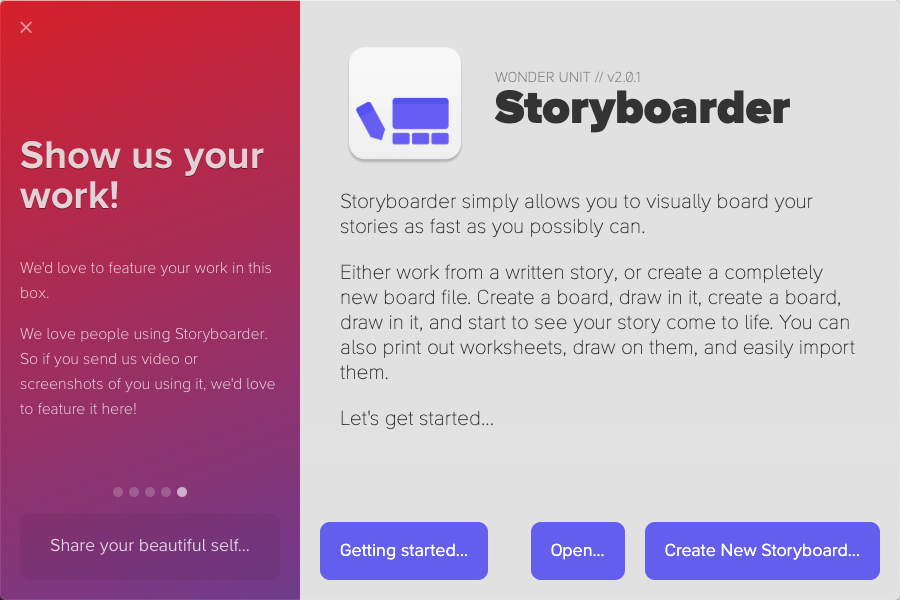
# Bonus Activity: Storyboarding using Storyboarder
In this exercise, you will create a simple storyboard. If you have any questions or get stuck as you work through this, please ask your instructor for assistance. Have fun!

1. Download and install the free Storyboarder software:
- Navigate to [Storyboarder](https://wonderunit.com/storyboarder/){:target="_blank"} in your web browser and click on the Download For Free button. 
- Locate the file you’ve downloaded and double-click on it to start the installation process.
- Once installed and launched, click on the Create New Storyboard button
- From the two project options, choose Create a blank
- Next will be options for Aspect Ratio. For this example, we will be using 16:9 
- Give your project a name, choose where it will be saved, and then click Create

2. 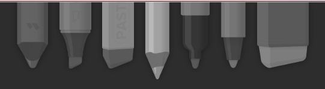 Across the top of the screen are various pen and pencil tools, as well as an eraser. You can click on any of these and then choose a color using the swatches to the right of the pens. To access the full range of colours, click on the largest swatch.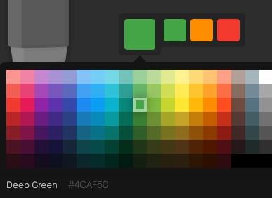  Below the largest swatch are the Size and Opacity tools. Click and drag them to the left and right to increase and decrease them. 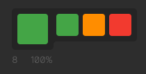

3. 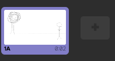 You can draw on the first blank board to represent the setup of your first video scene. Remember that storyboards do not need to be detailed or artistic -- the point is to remember and/or communicate how you want each shot to be set up on the day of filming. You can include as many scenes or as few as you think you will need for your project. 
- 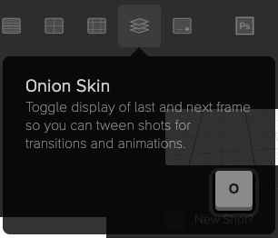 Click on the **grey plus sign** next to the board thumbnail at the bottom left of the screen to add a new board. The new board will have faint outlines of your previous board to show you the previous scene using a function called Onion Skin. You can toggle this function on and off when needed by clicking the Onion Skin button in the top right or tapping the letter O key on your keyboard. 

- 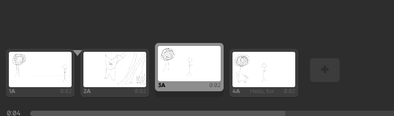 Keep adding a few boards to your story. If you need to change the order, right click on the board and then click “**reorder right**” or “**reorder left**”. If you switch to the “**timeline**” view at the bottom of the screen, you can click and drag the boards. An arrow will appear. Drag over until the arrow is pointing where you want the board to move and then release the mouse. 

- You can turn on the grid lines using the buttons in the top right to help line things up. 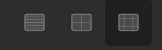
- On the right, there are fields for each board you can fill out with Notes and Dialog and Action instructions
- You can choose how long each shot will be under Duration if that is necessary for creating a timeline for your project. The default is 2 seconds per board.

- There is a space for uploading audio. This can be anything from the music you want for your project or you can talk through the scenes or read aloud the dialog that the actors will be speaking to get a sense of what will be happening. 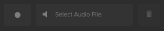 To upload audio, click the Select Audio File button and navigate to where your audio file is saved, then click Open. (If your audio clip is longer than the frame you assigned it to, it will play over the audio assigned to other frames.) 

4. The Shot Generator can be accessed by clicking on it to open it. This has a couple of functions. One of them is to set up advanced camera settings, but the other is handy if you don’t want to draw but still want to set up storyboards. This is especially useful if you want to get body positions across and are not confident in your drawing skills. To do that, follow these steps with Shot Generator open:
- Click on **Character** in the top menu. This will place a generic character into the scene. To customize what sort of character this is, go over to the left sidebar menu and click on the **two-person tab**. You can click on the various models to switch between them. To further customize this model, you can click on the **tab with lines** on it to change rotation, height, weight, etc. 

- To change the character Pose, click on the **tab with the figure outstretched**. You can search for various poses and click on them to move your character into these poses and adjust them manually by dragging the dots at the joints on the character. To rotate your character, go back into the first tab and change the Rotation. 

- To add another Character, follow the same steps again. 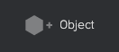 You can move the character’s position on the board by dragging it around. 
- 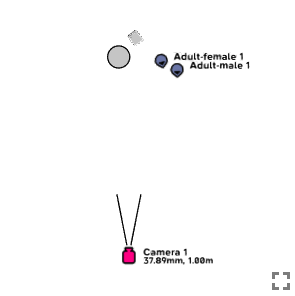 To add Objects to the board, click on **Object** at the top. This will default to adding a box. You can change the object by going to the sidebar menu and clicking on the two-person tab and clicking on a different object.
- Use the overhead view frame in the top left corner to drag objects and characters and the camera around so that everything is set in relation to each other the way you want them to be for that scene. 

- Once satisfied with the board, click on **Insert as New Board** 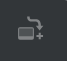 in the top right and the board will be added to your timeline. From there, you can draw over the top of it, add audio, dialogue, etc. Alternatively, if you click on **Save to Board**, it will add the characters and objects to whichever board you already had that is currently active.
- To get out of Shot Generator, click on the **Red dot/X** in the corner to close the window. 

5. Once you’ve created a series of boards, click on the first board, and then click on the Play button at the bottom centre of the screen to watch your story in action. 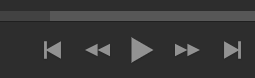
6. You can export by going to File and then Print or export to PDF to create a printout or PDF pages of your storyboard.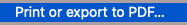 From there, you can select the layout preferences you want and see a preview. 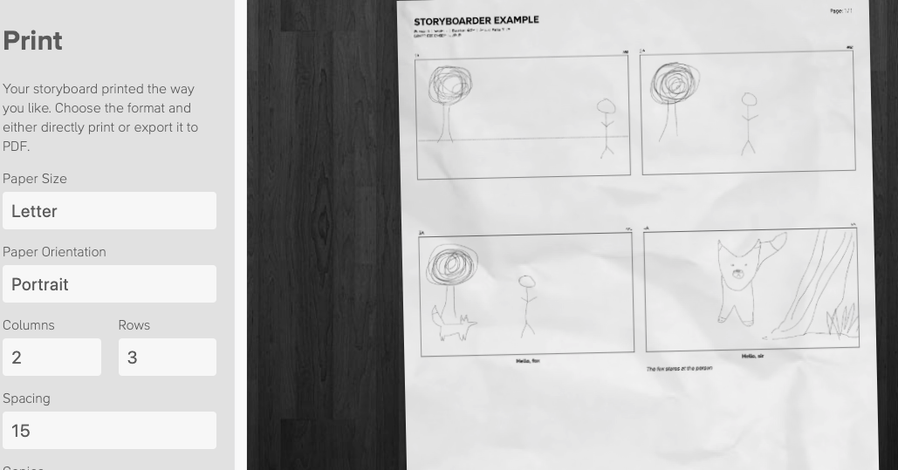

7. Alternatively, you can go to File and export as various formats such as GIF, Video (mp4), Images (png). 
Note: Storyboard also gives you the option to draw on paper and import these images to use the other functions of Storyboard if you are more comfortable with drawing on paper, using the Import Worksheets function. 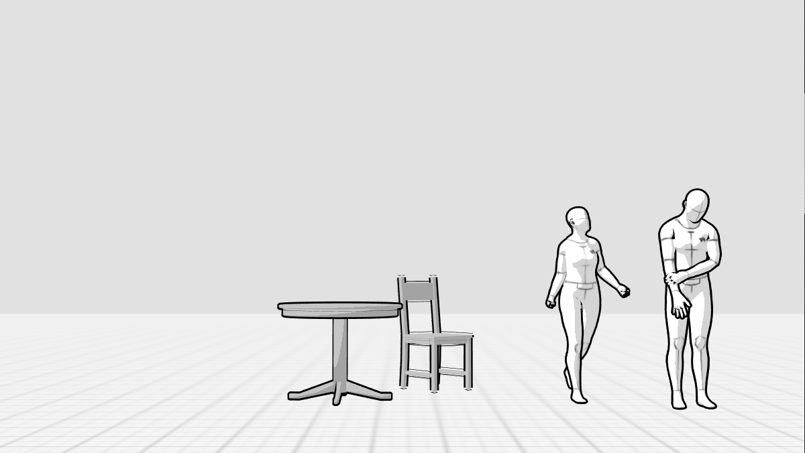

Some useful links to help you:
- [Storyboarder FAQ](https://wonderunit.com/storyboarder/faq/){:target="_blank"}
- [How to modify a scene in Shot Generator](https://www.youtube.com/watch?v=dojzTtvr9xk){:target="_blank"}
- [Automatic Shot Generator](https://www.youtube.com/watch?v=_0hI-FBqwB0){:target="_blank"}

[NEXT STEP: Earn a Workshop Badge](informal-credentials.html){: .btn .btn-blue }
