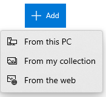
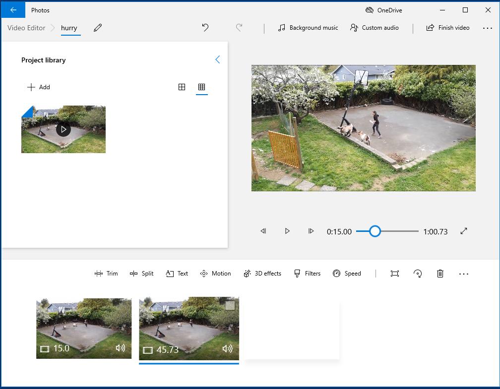
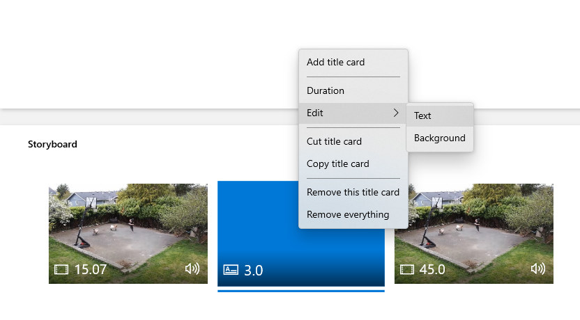
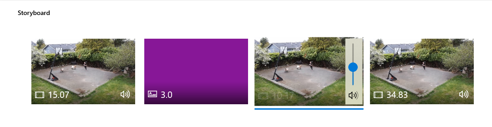

# The Basics
In this exercise, you will create and edit a movie using Microsoft Video Editor. If you have any questions or get stuck as you work through this, please ask your instructor for assistance.  Have fun!

Pre-class Activity Preparation:

-   Make sure the Microsoft Video Editor is installed on your computer by pressing the **Windows logo** button on your keyboard and then typing “**video**” (see the image on the right).
-   Open Microsoft Video Editor by clicking on the “**Video Editor**” icon.

1.  If you don’t have a video that you want to edit, let’s start by downloading the following video, and saving it to your desktop: [http://bit.ly/dsc-goat-video](http://bit.ly/dsc-goat-video){:target="_blank"} It may take 1 or 2 minutes to download.

    

2.  If the video starts playing you will have to right mouse click on the video & select “**Save Video As...**” and save it to the **Desktop** folder on your computer.

    

3.  Open Microsoft Video Editor if you have not already done so.
    -   Click on the **New Project** icon.
    -   When prompted, give your video project a name (“**test video**” would be just fine).
    -   Click “**OK**”

    

4.  In the “**Project Library**” pane, click the “**+ Add**” button and select “**From this PC**”
    -   Select “**Pictures**” on the left navigation pane and then select “**goats.mp4**”
    -   Finally, click on the file and select  “**Open**” on the bottom right of the dialog box.
5.  Drag your mp4 from the Project Library pane down to the Storyboard pane. It should take up a slot. Selecting this slot enables you to click the **Play** icon or scrub through your video in the top right pane, similar to how one would navigate Youtube videos.

    
    

6.  First, play the 90-second video by pressing the play button below the video. (Note: pressing the spacebar will start and stop the video which is very handy while editing)
7.  Trim 20 or 30 seconds off the end of the video by selecting the video in the storyboard pane and then clicking the “**Trim**” option. It will present you with two sliders, and you position them around what you want to keep. Make sure the leftmost slider is positioned at the start of the video, and position the rightmost slider at roughly the 1-minute mark. Then click “**Done**” in the bottom right.

    

8.  Next, let’s split the video at approximately the 15-second mark from the beginning. To do this, select the video in the storyboard pane and then select the “**Split**” option. On the new screen, drag the handle to roughly the 15-second location and click “**Done**” in the bottom right. Now you have two clips!

    
    

9.  The trimmed and split video should now look like the photo below.

    

10.  **Optional** - Add a card between the two clips:
     -   Select the clip that we want to have a title card before (in this case, the second clip).
     -   Select the “**Add title card**” option to add a default blue title card which displays the text “Title”.
     -   To change the default text, right-click the card and mouse over “**Edit**”. Select “**Text**”, click into the text box in the top right, and change the text to something more appropriate like “Raisins”. Feel free to also choose a fun font from the menu on the right.
     -   Challenge: Change the colour of the card to purple.

     
     

11.  Let’s add a title to the video:
     -   Select the first clip from the storyboard pane and then click the “**Text**” option.
     -   In the top-right text box, replace “Title” with your chosen title, such as “Feeding Time”.
     -   To change the location of the text, select your preferred text layout from the “**Layout**” menu in the bottom right.
     -   Select a fun font for your title from the menu on the right.
     -   The handles on the bottom show where the title will be displayed in your clip. Make sure that the leftmost handle is at the start of the clip and move the rightmost handle to roughly the 5 second location.
     -   Click “**Done**” in the bottom right when you are satisfied with the style of your title.

     
     

12.  Now let’s add credits for your video. Video Editor only lets you add credits in the form of the text that you previously added for the titles:
     -   Select the final clip from your storyboard pane and split it into several pieces as previously shown in step 8.
     -   For each piece, add some “**Text**” as shown in step 11.
     -   Change the text so that it is in the center and type a reasonable amount of your credits. Click “**Done**”.

     
     

13.  Next, let’s reduce the volume of the audio during the credits:
     -   Select a video clip from your credits in the storyboard pane.
     -   In the bottom right of the clip’s thumbnail in the storyboard pane, click the volume icon.
     -   Drag the slider to adjust that clip’s volume. Do this for all your credits clips.

     
     

14.  Once you’re happy with your edited video you’ll need to export it in order to upload it to YouTube, or share it via Google Photos or some other sharing service:
     -   Press the “**Finish video**” button in the top right.
     -   Select whichever quality you want from the drop-down menu (higher quality results in larger files).
     -   Click “**Export**”, select where the file will be saved and give it a memorable name. Click “**Export**” again.

     
     

15.  Congratulations, you’ve created and edited a video in Microsoft Video Editor! If you want to post your video to YouTube, just upload the file to your YouTube account.

[NEXT STEP: Slow Motion and Cropping](ve-cropping-slo-mo.html){: .btn .btn-blue }
