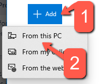
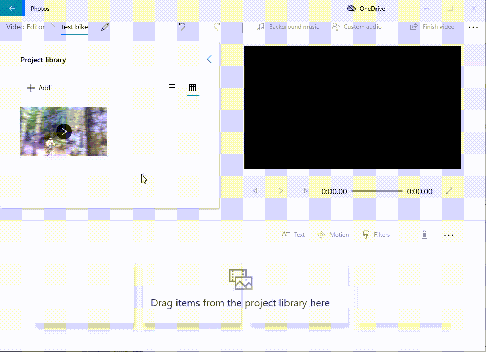
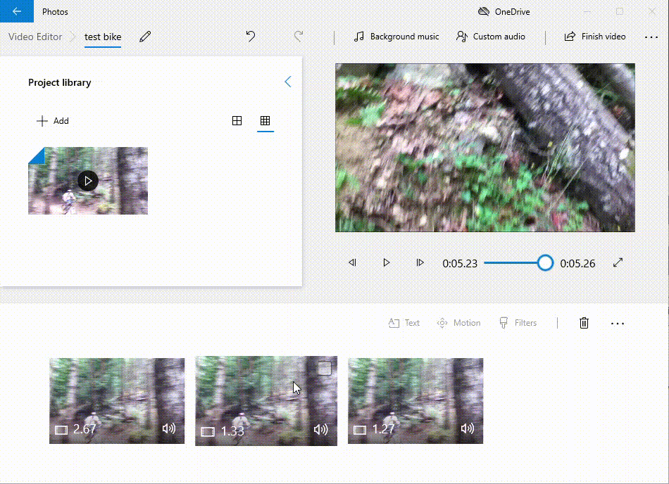
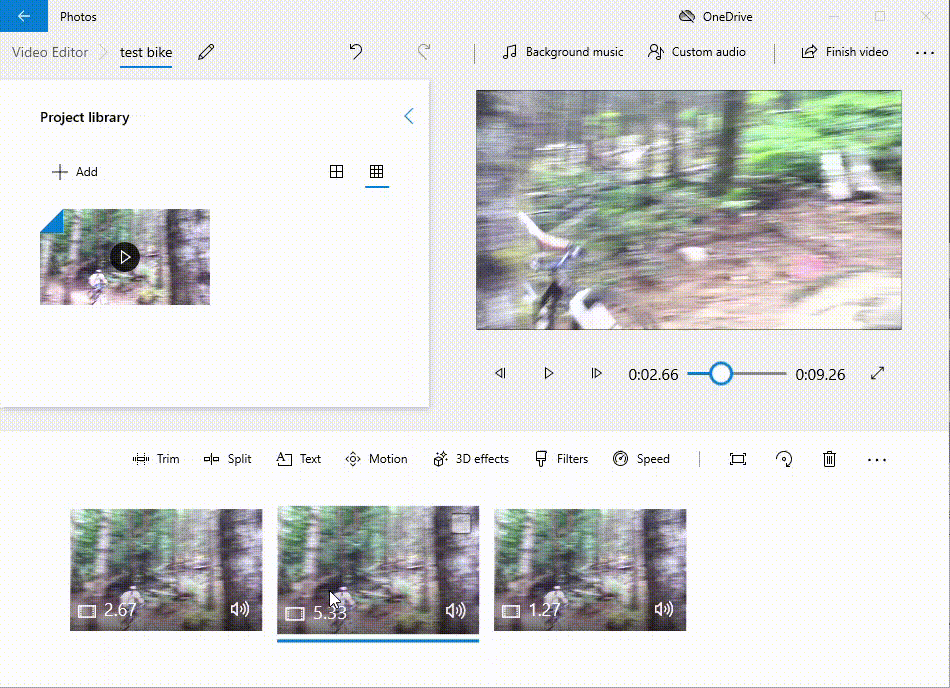

# Slow Motion and Cropping
In this exercise, you will create and edit a movie in Microsoft Video Editor, including using splitting and duplicating a video clip, making a slow-motion video clip, cropping a video clip, and importing audio to overlay your clip. If you have any questions or get stuck as you work through this, please ask your instructor for assistance.  Have fun!

1.  Let’s start by downloading the Mountain biking video and save it to your computer: [https://bit.ly/3vrLJj0](https://bit.ly/3vrLJj0){:target="_blank"}. If the video starts playing you will have to right mouse click on the video & select “**Save Video As...**” and save it to the **Desktop** folder on your computer
2.  If Microsoft Video Editor is not open on your computer, press the **Windows logo** button on your keyboard and then type “**video**” (see the image on the right), and then click on the “**Video Editor**” icon.

    

3.  Open Microsoft Video Editor if you have not already done so.
    -   Click on the **New Project** icon.
    -   When prompted, give your video project a name (“**test bike**” would be just fine).
    -   Click “**OK**”

    

4.  In the “**Project Library**” pane, click the “**+ Add**” button and select “**From this PC**”
    -   Select “**Desktop**” on the left navigation pane and then select “**bike.mp4**”
    -   Finally, click on the file and select  “**Open**” on the bottom right of the dialogue box.
5.  **Drag** the bike video you just imported from the **Project Library** to the **Timeline** at the bottom of the Video Editor window:

    

6.  Now you’ll make a slow-motion video clip with the “**bike**” video:
    -   Let’s isolate a short clip to slow down. Start by clicking on the **Split button**.
    -   **Move the blue cursor** to the point in the video just before the rider starts to jump (see video below).
    -   Click on the **Done** button (see video below).
    -   **Select** the second video in the timeline, and **move the blue cursor** to the point in the video where the bike lands (see video below).
    -   **Click** on the **Done** button (see video below).
    
        
    
    -   **Click** on the **middle of the 3 video clips** in the timeline.
    -   To slow down the clip you just selected, press the **Speed** button above the timeline (see video below).
    -   Then **drag** the slider to **0.25** (see video below)

        

7.  Crop or zoom in on a video clip:
    -   **Click** on the **middle of the 3 video clips** in the timeline.
    -   To zoom in and to the right on this clip, press the **Motion** button above the timeline (see video below).
    -   **Select** the **Zoom in Right** button on the right, and then **press** the **Done** button (see video below). 

    

8.  Congratulations, you're done! Feel free to add a title & credits to your video if you want. Your video should look something like this: [https://goo.gl/gkqx8b](https://goo.gl/gkqx8b){:target="_blank"}

[NEXT STEP: Adding Audio and Free Music](ve-audio-music.html){: .btn .btn-blue }
